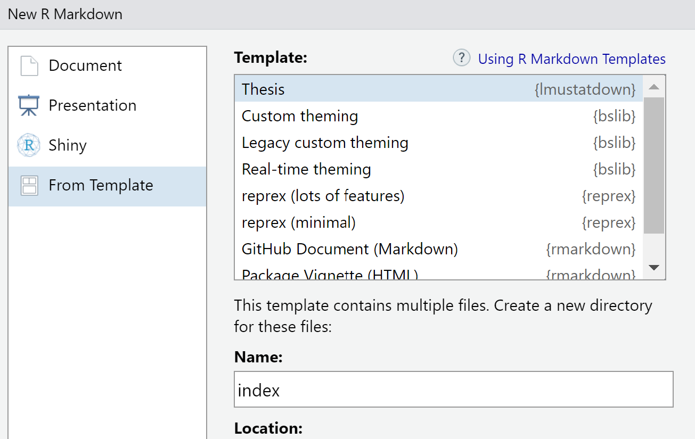

<!-- README.md is generated from README.Rmd via `devtools::build_readme()`. Please edit README.Rmd -->
<!-- Include HTML for custom styling -->

# <span style="color: rgb(0, 136, 58);">lmustatdown</span>

The `lmustatdown` package provides a handy template for writing a
dissertation or Bachelor’s/ Master’s Thesis at the Department of
Statistics, LMU Munich, and rendering those files in a PDF format
following the LMU SLDS LaTeX template found
[here](https://de.overleaf.com/latex/templates/lmu-slds-thesis-template/mhnhsykmqpvm).

The original work, package `thesisdown`, can be found
[here](https://github.com/ismayc/thesisdown).

This introduction, as well as a large part of the structure of this
package, is based on its similar derivation made by the Humboldt
University of Berlin, which can be found
[here](https://github.com/phinguyen44/huwiwidown).

Students will be writing in `R Markdown`, which is quite familiar to
SLDS students at LMU, and the `bookdown` package (powered by
[pandoc](https://pandoc.org) ) is used to convert the code into LaTeX
code and finally into a PDF document. (This package solely supports
PDF-output according to the requirements of the department.)

In the event that you’ve never used `bookdown` before, check out this
[handy tutorial](https://bookdown.org/yihui/bookdown/).

An example of the output can be seen [here](thesis-example.pdf).

## <span style="color: rgb(0, 136, 58);">Usage</span>

### <span style="color: rgb(0, 136, 58);">Initial Setup</span>

1.  To install the template, be sure you have the following:
    - [pandoc](http://pandoc.org/)
    - [LaTeX](https://www.latex-project.org/get/)
    - [R \>= 3.5.1](https://r-project.org)
    - [RStudio](https://rstudio.org) (optional, but it helps)
2.  Install the necessary packages:

``` r
if (!require("devtools")) {
  install.packages("devtools", repos = "http://cran.rstudio.org")
}
devtools::install_github("rstudio/bookdown")
devtools::install_github("Yc-Han/lmustatdown")
```

3.  Create a New R Markdown document in RStudio:

File -\> New File -\> R Markdown… then choose `From template`, then
choose `Thesis \{lmustatdown\}`, and enter `index` as the **Name**. Note
that this will currently ONLY be able to **Knit** if you name the
directory `index` at this step.

<p align="center">

</p>

If you’re not using RStudio, navigate to an empty directory and then run
the following code:

``` r
rmarkdown::draft("index.Rmd", template = "thesis", package = "lmustatdown")
```

### <span style="color: rgb(0, 136, 58);">Rendering</span>

To render your thesis, you can open `index.Rmd` in RStudio and then hit
the “knit” button. Alternatively, you can use:

``` r
rmarkdown::render("index.Rmd")
```

Your thesis will be deposited in the `thesis-output/` directory.

## <span style="color: rgb(0, 136, 58);">Writing Thesis</span>

The following describes the components in the template. Getting familiar
with these files will guide you in writing your thesis.

### <span style="color: rgb(0, 136, 58);">`index.Rmd`</span>

This file is first created when generating a new template. It contains
all the relevant meta-information (e.g. name, thesis title, advisor
names). You will need to fill out the sections at the top of the page,
which will then auto-populate your “Title Page” and “Declaration of
Authorship”. If you are also familiar with the YAML header, you can also
add additional LaTeX parameters or decide whether you want to add
optional pages to your thesis such as the “Acknowledgements” section or
the “List of Tables”.

### <span style="color: rgb(0, 136, 58);">`_bookdown.yml`</span>

This is the main configuration file for your thesis. It determines what
Rmd files are included in the output, and in what order. Arrange the
order of your chapters in this file and ensure that the names match the
names in your folders. The first file should always be the `index.Rmd`
file. The rest will be the files that you create. Some example files are
already included to help you along your way.

### <span style="color: rgb(0, 136, 58);">`sections/`</span>

These are the sections or chapters that will be bound together in the
final render. Here’s where you write the sections that make your thesis.
You can name the files whatever you like, so long as they are indexed in
the `_bookdown.yml` file.

In your day-to-day writing, you will be working with these files. You
can write in markdown, just like you would in R Markdown. You can also
write in LaTeX syntax if you prefer.

### <span style="color: rgb(0, 136, 58);">`bib/`</span>

Store your bibliography (as `bibtex` files) here. [This
website](http://bibdesk.sourceforge.net/) may be helpful in generating
the `bibtex` file in the correct format. You will need to cite the items
in your thesis after adding them to the `references.bib` file in order
for them to appear in your bibliography.

### <span style="color: rgb(0, 136, 58);">`figures/` and `data/`</span>

Store your figures and data here and reference them in your R Markdown
files.

## <span style="color: rgb(0, 136, 58);">Structure of Thesis (Default)</span>

The structure of the thesis template is as follows:

**Frontmatter:**

- titlepage (mandatory, auto-generated from template)
- acknowledgement (`prelim/00-acknowledge.Rmd`)
- abstract (`prelim/00-abstract.Rmd`)
- table of contents (mandatory, auto-generated from template)
- list of abbreviations (not mandatory, `prelim/00-abbreviations.Rmd`)
- list of figures (not mandatory, auto-generated from template)
- list of tables (not mandatory, auto-generated from template)

**Body:** the structure of the thesis body is not mandatory, but the
references are:

- introduction (`sections/01-intro.Rmd`)
- methods (`sections/02-method.Rmd`)
- data (`sections/03-data.Rmd`)
- results (`sections/04-results.Rmd`)
- conclusion (`sections/05-conclusion.Rmd`)
- appendix (not mandatory, `sections/99-appendix.Rmd`)
- references (mandatory, auto-generated from template)

**Last page:**

- declaration of authorship (mandatory, auto-generated from template)
